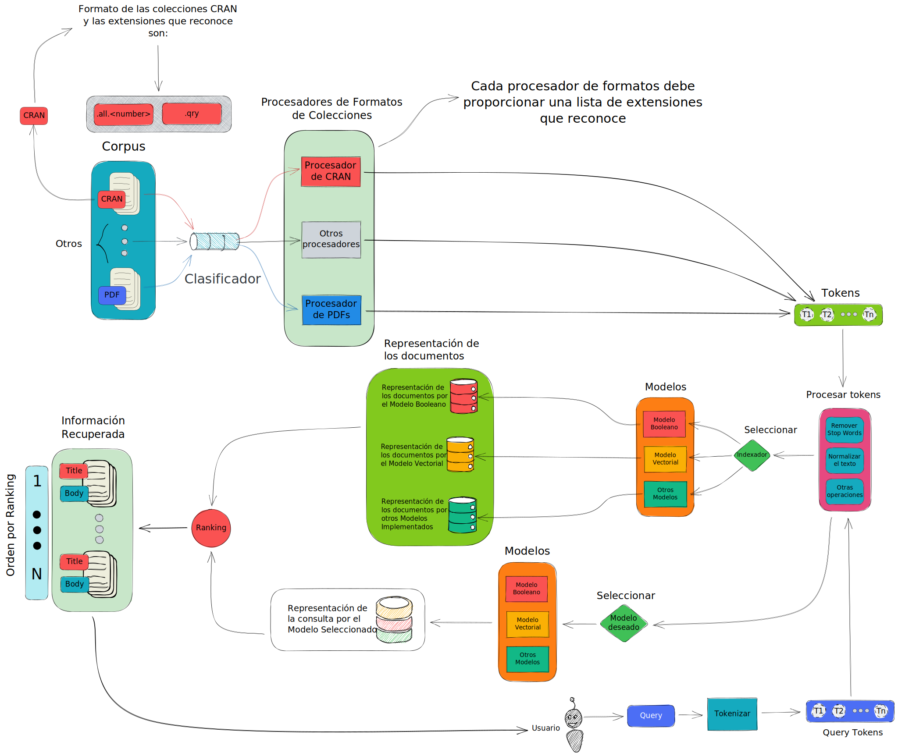

# IRS project

## About

This project is for educational purposes. The objective is to implement 3 *Information Retrieval Systems* for the final delivery. Actually there is only one model implemented, the *Classic Vector Space Model*.

If you need more info about the implementation done here please refer to this [file](Pre-entrega.md) and translate with google translate 😅

## Arquitectura del Proyecto



## Installing Dependencies

### Without Docker

Before running the project is necessary that you install all the dependencies of the project. The way to do this is running the following commands in the shell.

**NOTE:** We recommend that you create a custom environment before installing the python dependencies

```shell
$ pip install -r ./requirements.txt
$ python install.py
```

### With Docker

How to build
```shell
$ docker build -t irs-final-project .
```

## How to run the Project

For now this project have a very simple *cli.py* file (command line interface) for ranking documents in the *Cran* collection that is already serialized in the "irs_data/Vector Space Model.pkl" file (using python pickle package).
The way of running is simple:

```shell
python cli.py
```

Note: This *cli* is simple because is not the way we want to interact with the user. In the future previous to deliver to our teachers we well create an interface in flutter that will interact with a server created in Django (this decision may change).

### With docker

If you build the docker image as we told in the *installing dependencies* section, you can run it executing the following command

```shell
$ docker run -it --name irs irs-final-project:latest bash
```

**NOTE:** If you have podman instead of docker just substitute `docker` by `podman` in all the commands where you find it

## Forking

Feel free to fork and do whatever you want with this code. There is nothing special here yet (and probably never because we have other projects in mind).
